# AwesomeChat
Ứng dụng được viết bằng Kotlin, ứng dụng xây dựng theo mô hình MVVM, sử dụng Firebase để lưu trữ dữ liệu, sử dụng Share Preference, Retrofit2, Navigation Component, Live Data, ViewPager2, ListAdapter, ...

Ứng dụng bao gồm các chức năng:
* Đăng ký
* Đăng nhập
* Nhắn tin cá nhân 1-1, gửi tin nhắn dưới dạng text, ảnh, sticker
* Gửi lời mời yêu cầu kết bạn, chỉ nhắn tin được khi là bạn bè của nhau
* Có notification mỗi khi có tin nhắn mới hoặc có lời mời/ đồng ý kết bạn
* Multi language
* Edit user profile

Tải bản APK: [Awesome Chat](https://drive.google.com/file/d/1R9WdSS6Wzd4TqEDwlBegG6QCP02jhpGF/view?usp=sharing)

## Splash Screen

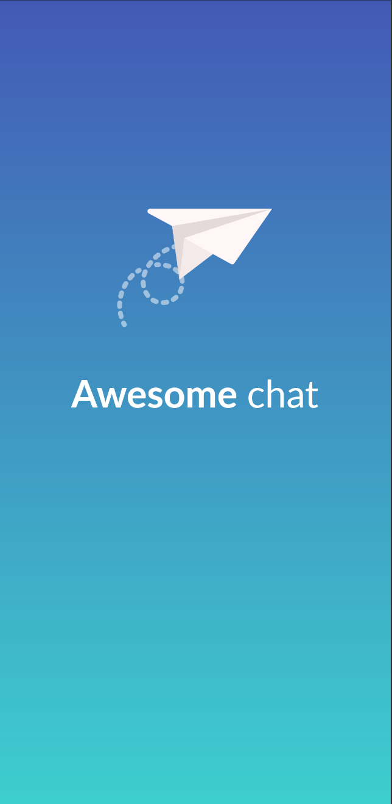

## Log In Screen
1. Các trường dữ liệu chưa được nhập

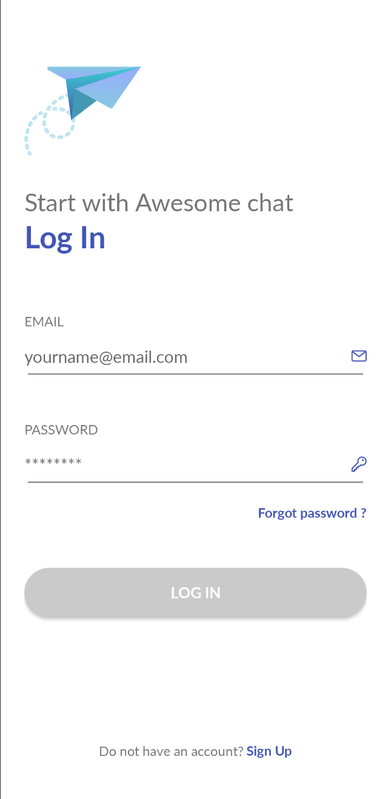

2. Khi các trường dữ liệu được nhập thì nút Log In đổi màu và có thể click

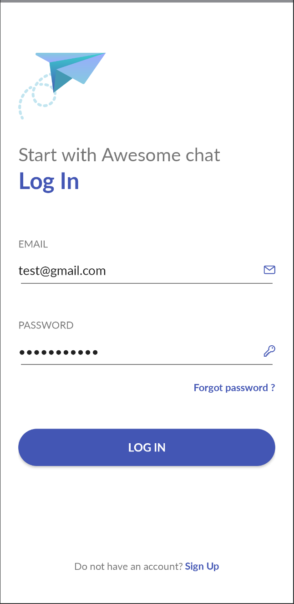

3. Khi một trong các trường thông tin không đúng, có thông báo hiện lên

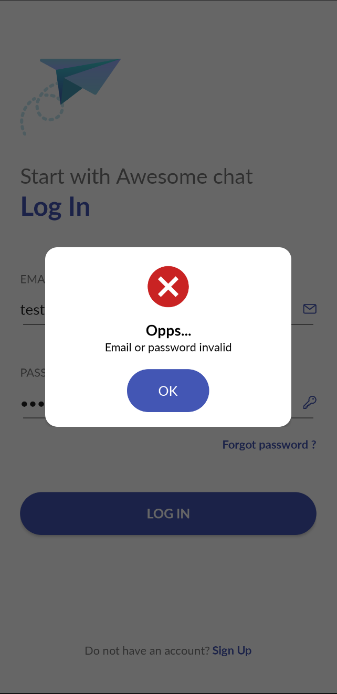

## Sign Up Screen
1. Các trường dữ liệu chưa được nhập

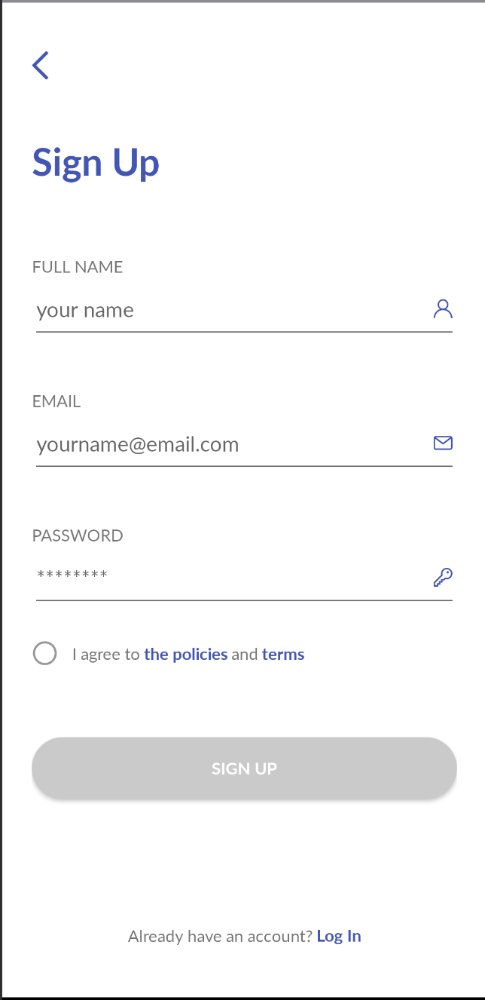

2. Khi các trường dữ liệu được nhập thì nút Sign up đổi màu và có thể click

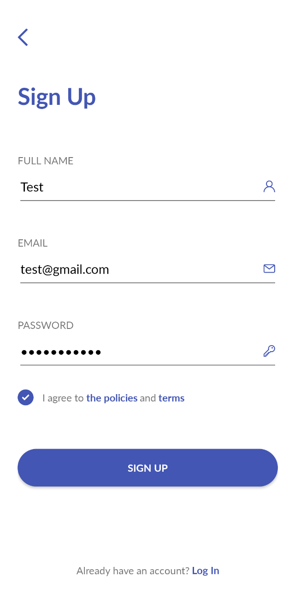

## Home Screen
1. Chats Screen

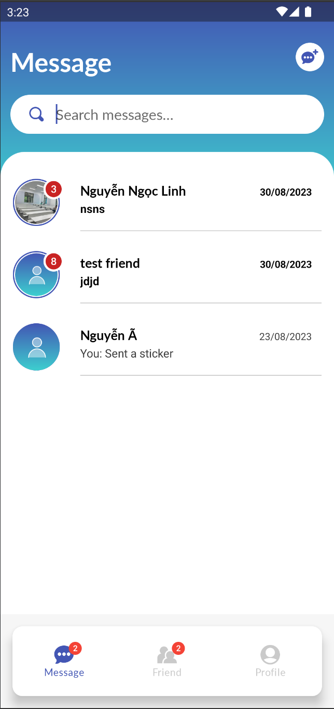

* Có thể tìm kiếm đoạn chat bằng nội dung tin nhắn

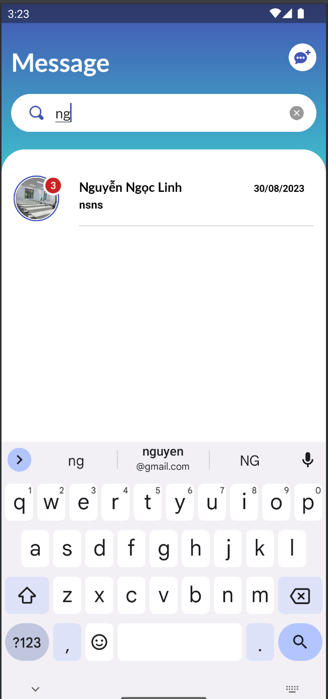

2. Friend Screen
* Real Friend Screen(Màn bạn bè) 

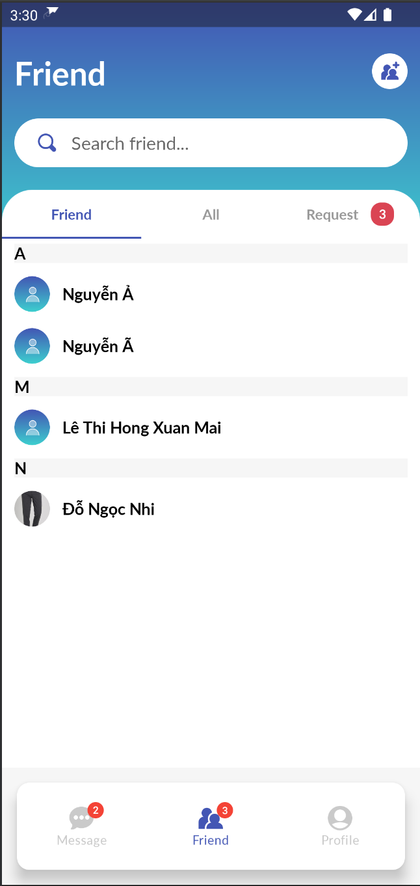

* All Friend Screen(Màn tất cả người dùng app)

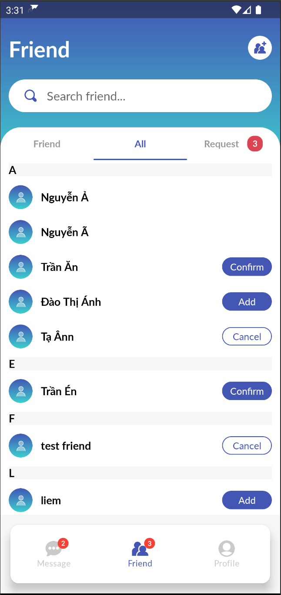

* Pending Friend Screen (Màn nhận được yêu cầu kết bạn hoặc gửi lời mời kết bạn)

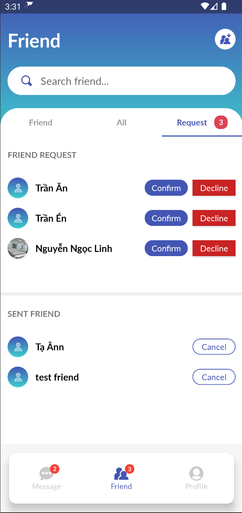

3. Profile Screen

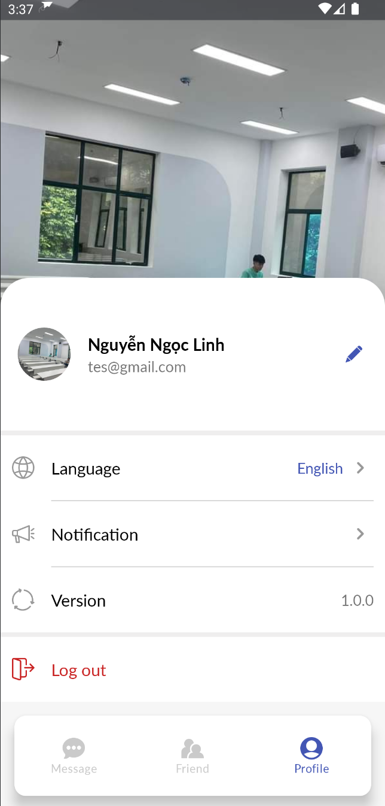

## Messages Screen
* Có thể gửi tin nhắn dạng text, ảnh, sticker.

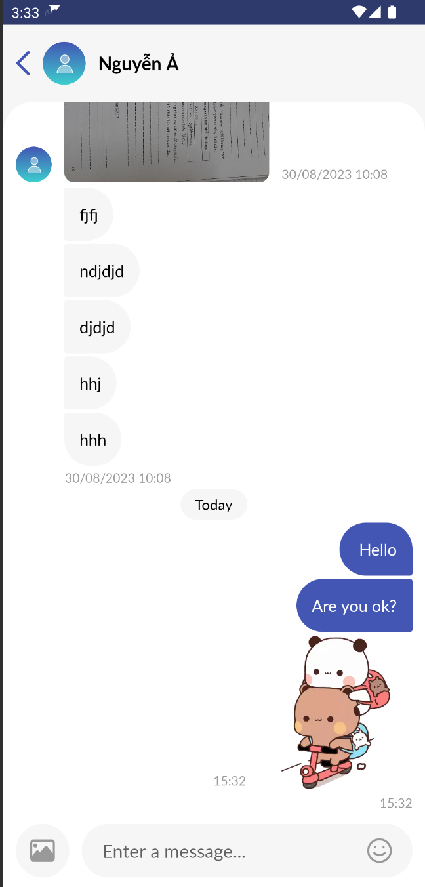

## Profile Detail Screen

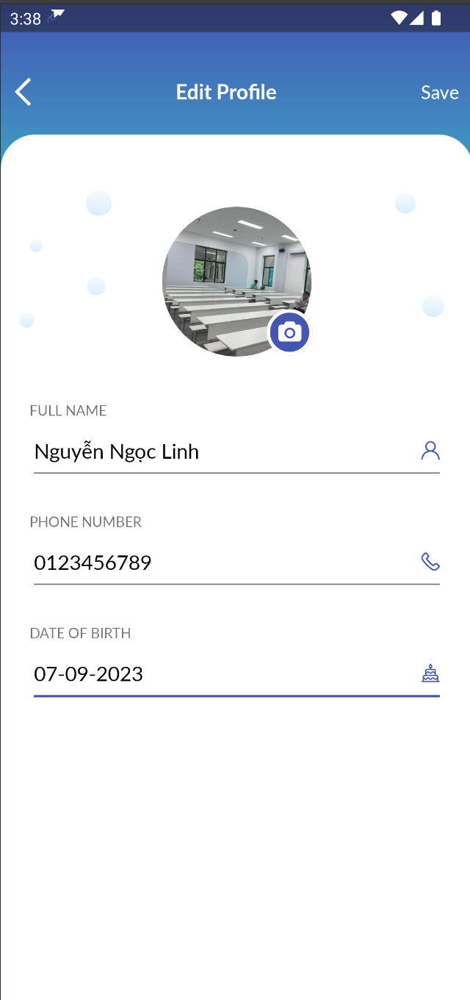
